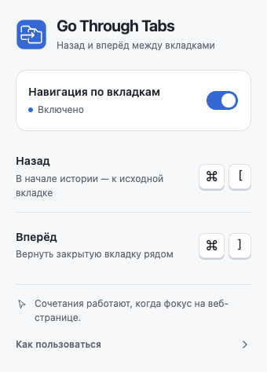

# Go Through Tabs для Chrome на macOS

`⌘ [` и `⌘ ]` соединяют обычную историю страницы с переходами во вкладки, открытые по ссылкам.

Chrome 120+, macOS. Интерфейс на русском языке. Расширение работает локально, без серверов и аналитики.



[Тёмная тема](screenshots/popup-native-dark.png) · [Конфиденциальность](PRIVACY.md) · [Публикация](PUBLISHING.md)

## Установка

Скачайте [готовый ZIP версии 1.1.2](https://github.com/CrazyMeizy/Go-Through-Tabs/releases/download/v1.1.2/go-through-tabs-1.1.2.zip) из [выпуска](https://github.com/CrazyMeizy/Go-Through-Tabs/releases/tag/v1.1.2) и распакуйте его. Для установки из исходников используйте папку `extension/`.

1. Откройте `chrome://extensions/` и **отключите Close on Back**. Его служебные записи истории конфликтуют с этим расширением.
2. Включите **Режим разработчика** справа вверху.
3. Нажмите **Загрузить распакованное расширение**.
4. Выберите папку `extension` внутри этого проекта. Если скачали ZIP, выберите распакованную папку `go-through-tabs`, в которой лежит `manifest.json`.
5. Перезагрузите существующие веб-вкладки. Для проверки откройте новую ссылку из исходной вкладки — связи, возникшие до установки, восстановить нельзя.

Папку загруженного расширения нужно оставить на диске. Установленное Close on Back не изменяется.

## Обновление до версии 1.1.2

Если в Chrome уже загружена папка `extension` из этого проекта, обновите файлы в ней. Откройте `chrome://extensions/`, включите **Режим разработчика** и нажмите кнопку **Обновить** (круговая стрелка) на карточке расширения. Оно появится под названием **Go Through Tabs**.

Если расширение загружено из другой папки, распакуйте `go-through-tabs-1.1.2.zip` и замените содержимое ранее загруженной папки файлами из `go-through-tabs`, затем нажмите **Обновить**. Использование той же папки сохраняет идентификатор расширения.

Перезагрузите веб-вкладки и откройте новые ссылки для проверки: обновление расширения очищает сессионную историю его связей. Close on Back должен оставаться отключённым.

## Как пользоваться

- Откройте ссылку в новой вкладке: через `⌘` + клик, среднюю кнопку, контекстное меню или ссылку с `target="_blank"`.
- `⌘ [` сначала проходит историю этой вкладки назад. У начала истории закрывает её и активирует исходную вкладку.
- `⌘ ]` возвращает страницы вперёд, затем восстанавливает закрытую вкладку рядом с исходной. Восстанавливается её история, а не только адрес.
- Можно проходить вложенные цепочки `A → B → C` и повторять закрытие/восстановление.
- Для `⌘` + клик и средней кнопки возврат работает даже до первого ответа сайта. Расширение сначала открывает локальный обработчик клавиш, затем заменяет его страницей сайта. У обычной ссылки выполняется один начальный запрос; лишнего шага истории нет. Ещё не загрузившаяся вкладка восстанавливается по сохранённому адресу без предупреждения о потерянной истории: такой истории ещё не было.
- Обработчики карточек могут остановить событие или сами открыть вкладку через JavaScript, выбрав другой адрес. В этом случае расширение защищает фактически открытую вкладку с GET-запросом. Если запрос уже начат, Chrome отменяет его и запускает снова через локальную страницу. POST-запросы сохраняют штатное открытие.
- Переходы внутри фреймов учитываются до перехода между вкладками. Команды, нажатые внутри доступного фрейма, действуют на всю вкладку.

Пример: `A0 → A1 → A2 → B0 → B1`. Назад: `B1 → B0 → A2 → A1 → A0`. Вперёд: `A0 → A1 → A2 → B0 → B1`; при переходе из B0 к A2 вкладка B закрывается, при обратном переходе восстанавливается.

Клик по значку расширения открывает переключатель. При выключении через этот переключатель сочетания выполняют обычную навигацию Chrome.

Окно следует светлой или тёмной теме системы. Переключателем можно управлять через `Tab`, `Space` или `Enter`; раздел **Как пользоваться** раскрывается с клавиатуры. Если состояние недоступно, **Повторить проверку** запрашивает его заново, не повторяя переключение.

## Правила истории

- Учитываются переходы по ссылкам, включая открытие в фоне. Ручные переключения между вкладками не записываются.
- Возврат идёт к текущей странице исходной вкладки. Если она успела перейти на другую страницу, расширение не откатывает её автоматически к моменту открытия ссылки.
- Новая страница или новая связанная вкладка сбрасывает прежнюю ветку «вперёд». Замена текущей записи, перезагрузка и обычный возврат назад её не сбрасывают.
- При нескольких закрытых дочерних вкладках в одной точке выбирается последняя закрытая доступная ветка.
- Вкладка без известного источника или с уже закрытым источником автоматически не закрывается.
- Перенос вкладки в другое окно разрывает её связи. Перестановка внутри окна сохраняет их; восстановление учитывает новое положение исходной вкладки.
- Восстановленная вкладка становится обычной, незакреплённой. Если источник закреплён, Chrome размещает её в первой допустимой позиции после блока закреплённых вкладок.

## Границы

Chrome 120+ на macOS, обычные окна и HTTP/HTTPS-страницы. Физические клавиши скобок распознаются через `KeyboardEvent.code`, в том числе при русской раскладке. Нужен фокус на странице, а не в адресной строке.

На служебных страницах `chrome://`, страницах других расширений, в Chrome Web Store и встроенном просмотрщике PDF остаётся штатное поведение браузера. Инкогнито не поддерживается. Дополнительные модификаторы `Shift`, `Option` или `Control` не перехватываются. Кнопки назад/вперёд браузера и жесты не закрывают и не восстанавливают вкладки; расширение отвечает именно за `⌘ [` и `⌘ ]`.

Ранний возврат до первого ответа сервера поддерживается для `⌘` + клик и средней кнопки на HTTP/HTTPS-ссылках, включая остановку события и GET-вкладку, открытую обработчиком сайта. Резервный путь применяется только к ещё пустой вкладке, открытой тем же документом и фреймом в течение 1,5 секунды после клика. Клавиши доступны после готовности локального обработчика; в самое первое мгновение пустой вкладки Chrome ещё не передаёт их расширению. Контекстное меню Chrome, `window.open` без такого клика, обычный клик по `target="_blank"` и POST-формы сохраняют штатное открытие: обработчик скобок доступен после появления первого документа, даже если изображения или другие ресурсы ещё загружаются. Отмена клика без открытия вкладки и ссылки с `download` не создают вкладок расширения. При отключённом переключателе расширение не меняет открытие ссылок.

Раннее открытие через локальную страницу не передаёт сайту заголовок HTTP `Referer` исходной страницы. Это может влиять на ссылки, для которых сайт требует этот заголовок; для штатного открытия используйте контекстное меню Chrome. Cookies остаются под управлением Chrome; сохранение cookie `SameSite=Strict` проверено в тесте.

Общая история хранится до полного закрытия Chrome. Остановка фонового service worker её не стирает. Отключение в `chrome://extensions`, обновление или перезагрузка самого расширения очищает сессионное хранилище Chrome.

Полное восстановление зависит от сессий Chrome. Если нужная сессия уже недоступна либо закрытие совпало с неоднозначным закрытием другой вкладки, расширение открывает сохранённый URL и показывает уведомление о недоступной внутренней истории. Состояние форм и приложения сохраняется в пределах того, что восстанавливает сам Chrome.

## Данные и разрешения

Нет серверов, аналитики, внешних скриптов и сетевых запросов расширения. Адреса и связи обрабатываются локально в `chrome.storage.session`, без синхронизации с аккаунтом Google.

`tabs` нужен для адресов и управления вкладками, `webNavigation` — для определения источника ссылки и фреймов, `sessions` — для восстановления конкретной закрытой вкладки, `storage` — для состояния между пробуждениями worker, `scripting` и доступ к HTTP/HTTPS — для клавиатурного обработчика. В версии 1.1.2 добавлено `webRequest`: адрес и метод главного запроса временно проверяются в памяти worker, чтобы резервное открытие не превратило POST в GET. Заголовки и тела запросов не запрашиваются. Содержимое страниц и введённый текст не сохраняются. Расширение не подменяет `history.state`; временный служебный URL заменяется сайтом после загрузки.

## Разработка и проверки

Node.js 20+:

```sh
npm test
npm run package
```

Сборка создаёт два архива: `go-through-tabs-<версия>.zip` для ручной установки и `go-through-tabs-chrome-web-store-<версия>.zip` для магазина. В архиве магазина `manifest.json` находится прямо в корне, а документы и тесты не включаются. Подробности публикации — в [PUBLISHING.md](PUBLISHING.md).

Для интеграционных проверок нужны только тестовые зависимости:

```sh
npm install
npx playwright install chromium
npm run test:browser
npm run test:loading
npm run test:popup
```

`HEADED=1 npm run test:browser` показывает тестовый браузер. Для проверки установленного Chrome используйте:

```sh
CHROME_EXECUTABLE='/Applications/Google Chrome.app/Contents/MacOS/Google Chrome' npm run test:browser
```

Тесты создают отдельный временный профиль и удаляют его после проверки; обычный профиль пользователя не используется. В установленном Chrome расширение загружается через тестовый CDP-интерфейс. Его флаг отладки применяется только к временному процессу.

`npm run test:popup` проверяет обе темы, переключение и повторное открытие окна, загрузку, ошибки, тайм-аут и безопасную повторную проверку, длинные уведомления, клавиатуру, контраст и уменьшенную анимацию. Скриншоты сохраняются в `screenshots/`. Иконки можно пересоздать из локального SVG командой `npm run icons` (нужен Playwright).

`npm run test:loading` удерживает первый HTTP-ответ и ресурсы незавершёнными. Проверяются ранний возврат и восстановление, обычный клик и обработчики карточек, остановка события, фактический URL из `window.open`, редирект, сохранение POST, отменённый клик, cookies, отсутствие источника, зависший фрейм и холодный worker. Обычная ссылка делает один запрос; отдельно проверяется резервное открытие с повторным GET и отсутствие лишнего шага истории.

Для проверки физических клавиш запустите `node tests/native.mjs`. В тестовом окне нажмите `⌘ [` три раза, затем `⌘ ]` три раза. Скрипт проверяет каждый шаг, закрытие, восстановление, внутреннюю историю и положение вкладки.

Проверки модели: порядок восстановления, цепочки и смена идентификаторов вкладок, одинаковые адреса, ветвление, ручные закрытия и переносы, отменённое закрытие, фреймы, устаревшие события и неоднозначные сессии. Интеграционные проверки используют загруженное расширение и настоящие API Chrome.

## Состав проекта

- `extension/` — готовое расширение, без зависимостей во время работы.
- `tests/` — проверки модели, браузера и физических клавиш.
- `scripts/package.mjs` — создание установочного ZIP и контрольной суммы.
- `dist/` — подготовленная папка и ZIP после сборки.
- `store/` — тексты карточки, скриншоты 1280 × 800 и промо 440 × 280 для Chrome Web Store. Пересоздание изображений: `npm run store:assets` (нужен Playwright).

## Лицензия и поддержка

[MIT](LICENSE) © 2026 Chuprov Dmitriy. Вопросы и сообщения об ошибках — через [Issues](https://github.com/CrazyMeizy/Go-Through-Tabs/issues). Не прикладывайте приватные адреса страниц или данные сессий.

## Если сочетание не работает

Проверьте, что Close on Back выключен, фокус находится на веб-странице, расширение включено и для сайта разрешён доступ. После обновления распакованного расширения перезагрузите вкладки. Новая версия не может восстановить связи и историю, возникшие до её установки.
